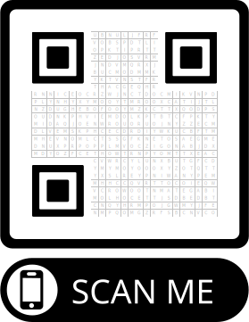

# QrPuzzle

You can use this notebook to make a fun puzzle using someone's name or another significant sequence of characters.
If you print it and shade in only the squares containing these characters, the result is a valid QR code
which can be scanned to reveal, for example, the destination of a surprise trip.

